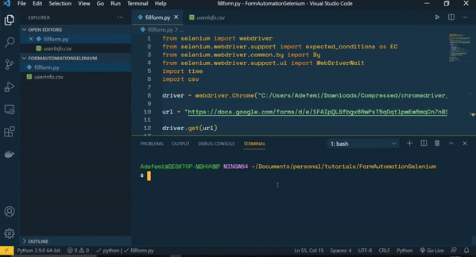

# AutoFormFills

AutoFormFill es una herramienta que automatiza el proceso de llenado de formularios de Google. Esta aplicación se diseñó para ahorrar tiempo en la tarea de completar repetidamente formularios similares o idénticos. La herramienta llena automáticamente las **preguntas de selección** en formularios de Google de manera aleatoria.



## Cómo se Creó

Este proyecto se desarrolló utilizando [Python](https://www.python.org/) y [Selenium](https://selenium-python.readthedocs.io/), una biblioteca de automatización web. El programa interactúa con el navegador web para seleccionar respuestas aleatorias en las preguntas de selección.

## Requisitos Previos

Antes de ejecutar esta herramienta, debes tener [Python](https://www.python.org/downloads/) instalado en tu sistema. Además, asegúrate de que el controlador de Selenium para tu navegador esté configurado correctamente. En este caso, se ha utilizado el controlador de Chrome.

## Cómo Ejecutar

1. Clona este repositorio en tu sistema local:

```
git clone https://github.com/tuusuario/AutoFormFill.git
```

2. Navega a la carpeta del repositorio:

```
cd AutoFormFill
```

3. Instala las dependencias:

```
pip install -r requirements.txt
```

4. Edita el archivo index.py con los parametros que se ajusten a tu formulario.

###

5. Ejecuta el programa:

```
python auto_form_fill.py
```

Sigue las instrucciones proporcionadas por el programa para completar un formulario de Google de manera automática.

## Contribuciones

Si deseas contribuir a este proyecto, por favor abre un issue o una pull request.
